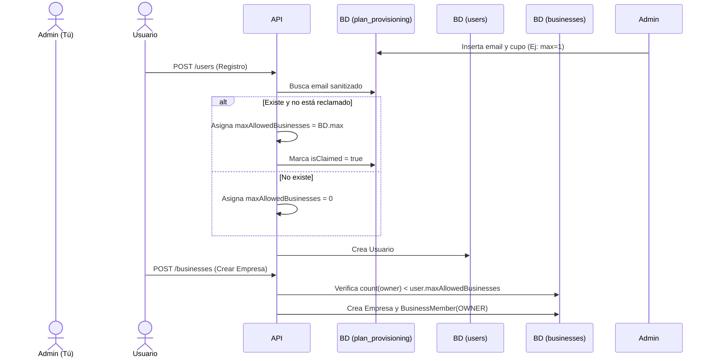

# Flujo: Registro de Usuario y Creación de Empresa

## 🎯 Objetivo

Describir cómo un cliente paga por el servicio, se registra en la plataforma y crea su espacio de trabajo inicial.

## 🧠 Reglas de Negocio (Reglas Estrictas para la IA)

1. **La fuente de verdad del cupo** al registrarse es la tabla `plan_provisioning`.
2. **El límite de creación** de empresas lo dicta el campo `user.maxAllowedBusinesses`, NO el plan provisioning.
3. El email debe estar sanitizado (`.trim().toLowerCase()`) en todas las validaciones.
4. Los empleados (invitados) se registrarán con cupo `0`, pero esto NO debe bloquear que acepten invitaciones a empresas de otros.

## 🔄 Diagrama de Flujo (Mermaid)

