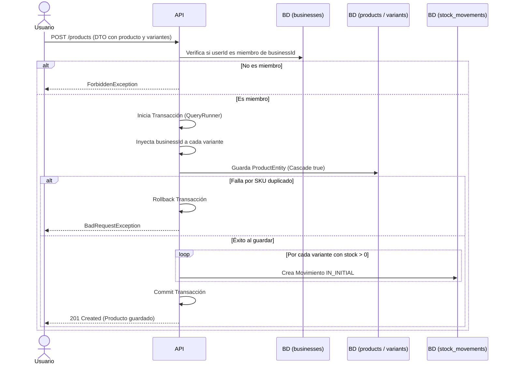

# Flujo: Creación de Producto y Variantes

## 🎯 Objetivo

Describir cómo un usuario autenticado crea un producto con sus variantes asociadas y registra el movimiento de stock inicial, garantizando la consistencia de los datos en una sola transacción.

## 🧠 Reglas de Negocio (Reglas Estrictas para la IA)

1. **Validación de Tenancy:** El usuario debe ser miembro de la empresa (`businessId`) para poder crear productos en ella (`businessRepo.findByUserId(userId)`).
2. **Unicidad de SKU:** El `sku` de cada variante debe ser único dentro de la misma empresa.
3. **Atomicidad (Transacción):** La creación del producto, la inserción de variantes en cascada y el registro de movimientos de stock deben ejecutarse de forma atómica usando un `QueryRunner`.
4. **Trazabilidad de Stock:** Se debe crear un registro de `StockMovementEntity` de tipo `IN_INITIAL` de manera automática únicamente para las variantes ingresadas con un `stock > 0`.

## 🔄 Diagrama de Flujo (Mermaid)

