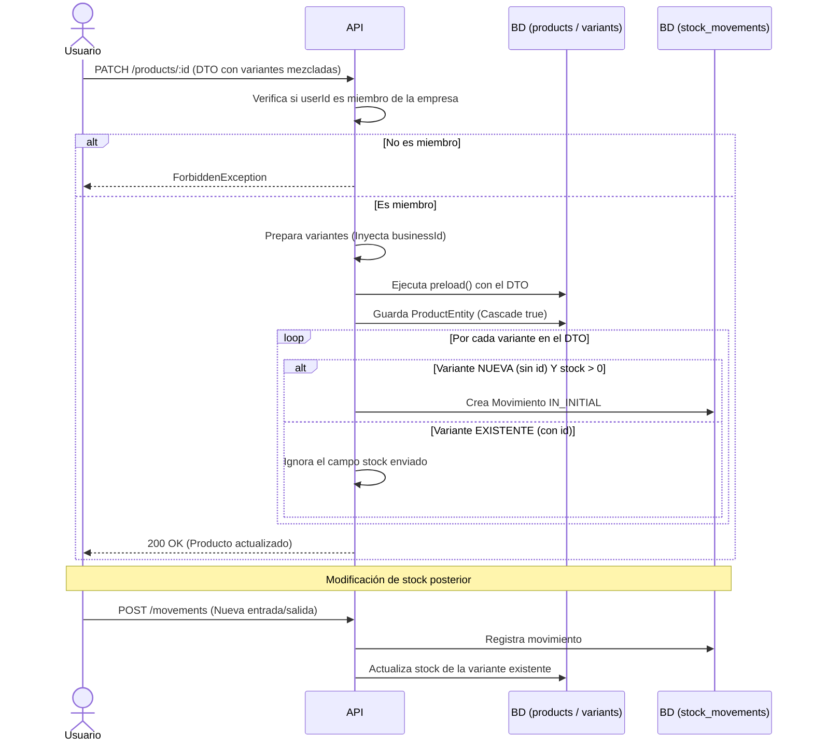

# Flujo: Actualización de Producto y Adición de Variantes

## 🎯 Objetivo

Describir el proceso para editar un producto, permitiendo agregar nuevas variantes con su stock inicial correspondiente y modificar atributos de variantes existentes, garantizando en todo momento la inmutabilidad del stock histórico.

## 🧠 Reglas de Negocio (Reglas Estrictas para la IA)

1. **Validación de Tenancy:** El usuario debe pertenecer a la empresa dueña del producto (`businessId`) para poder realizar cualquier modificación.
2. **Diferenciación de Variantes:** - Las variantes en el DTO **SIN** `id` se procesan como _nuevas creaciones_.
   - Las variantes en el DTO **CON** `id` se procesan como _actualizaciones_.
3. **Inmutabilidad del Stock Existente:** El campo `stock` enviado en el DTO es **ignorado** para las variantes que ya existen (que tienen `id`). La única forma de alterar el stock de una variante existente es a través del endpoint dedicado `POST /movements`.
4. **Trazabilidad de Stock Inicial:** Exclusivamente para las variantes **nuevas** (sin `id`) que se declaren con un `stock > 0`, el sistema debe registrar automáticamente un movimiento en `StockMovementEntity` de tipo `IN_INITIAL`.
5. **Fusión de Datos (Preload):** Se debe utilizar el método `preload` del repositorio de TypeORM para combinar los datos enviados en el DTO con el estado actual de la entidad en la base de datos antes de hacer el `.save()`.

## 🔄 Diagrama de Flujo (Mermaid)

